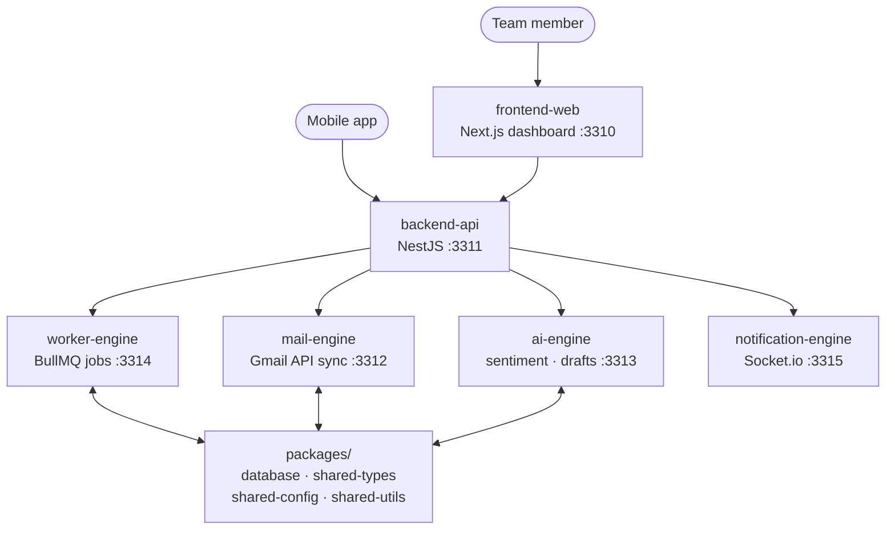

# AUDIRA-MAIL-OS — AI-Assisted Email Management Platform


A self-hosted email operations platform with AI assistance: unified inbox, phishing protection, automated drafting, workflow automation, and OTP management — organized as a TypeScript monorepo of focused microservices.

## About

Managing high-volume email across a team means context-switching between the inbox, security checks, follow-ups, and integrations. AUDIRA-MAIL-OS consolidates that into one system: a web dashboard backed by independent services for mail sync, AI assistance, background jobs, and real-time notifications, plus a mobile companion app for monitoring on the go.

## Features

- **Unified inbox** — central mailbox view across connected accounts
- **Phishing safety banner** — visual warnings on suspicious messages
- **Sandbox preview** — renders message HTML in an isolated iframe so scripts never execute
- **AI copilot** — sentiment analysis on incoming mail and AI-assisted reply drafts
- **Automation builder** — zero-code rules: auto-forward via webhook, assign to teammates, trigger actions
- **OTP center** — automatic OTP code extraction with shareable, self-destructing links
- **Real-time notifications** — WebSocket-driven alerts for new mail and events
- **Mobile app** — companion app for real-time monitoring (see `apps/mobile-app`)

## Tech Stack

| Service | Technology | Port |
|---|---|---|
| `apps/frontend-web` | Next.js (App Router) | 3310 |
| `apps/backend-api` | NestJS | 3311 |
| `apps/mail-engine` | Node.js (Gmail API) | 3312 |
| `apps/ai-engine` | Python / Node.js | 3313 |
| `apps/worker-engine` | Node.js (BullMQ) | 3314 |
| `apps/notification-engine` | WebSocket (Socket.io) | 3315 |
| `packages/*` | Shared: database, types, config, utils | — |

Build system: **pnpm workspaces + Turborepo**, containerized with Docker.

## Architecture



## Getting Started

### With Docker (recommended)

```bash
git clone https://github.com/Audira141415/AUDIRA-MAIL-OS.git
cd AUDIRA-MAIL-OS
docker compose up -d
```

### Local development

Requires Node.js and pnpm 8.

```bash
pnpm install
pnpm dev        # runs all services via Turborepo
```

Windows helpers are included: `start.bat` / `stop.bat`.

## Project Structure

```text
apps/
  frontend-web/         # Next.js dashboard
  backend-api/          # NestJS REST API
  mail-engine/          # Mail sync via Gmail API
  ai-engine/            # AI features (sentiment, drafts)
  worker-engine/        # Background jobs (BullMQ)
  notification-engine/  # Real-time notifications (Socket.io)
  mobile-app/           # Companion mobile app
packages/
  database/ shared-types/ shared-config/ shared-utils/
infrastructure/        # Deployment assets
docker-compose.yml
```

## Screenshots

> Dashboard screenshots will be added here. The web UI runs at `http://localhost:3310` after startup.

## Contributing

See [CONTRIBUTING.md](CONTRIBUTING.md).

## License

Proprietary commercial software. See [LICENSE](LICENSE).

## Author

**Agus Dwi R** — Data Center Engineer, Batam, Indonesia.
